# Designing the COVID-19 Home Monitoring System that saves medical officers 2,300 hours

<video controls autoplay loop muted playsinline>
  <source src="cosmos-dashboard.mp4">
</video>

## Problem

On April 11, 2020 Malaysia reported another 184 confirmed cases, raising total of COVID-19 cases to 4,530—the highest number in Southeast Asia. The rising number of cases has put a huge burden on our healthcare workload not only to tend to those admitted to the hospital, but healthcare workers have been tasked to routinely call patients with suspected Covid-19 infection who are sent home to self-quarantine, or those awaiting swab results.

## Solution

CoSMoS consists of a Telegram Chatbot for patients to report their symptoms daily and a Medical Dashboard for doctors to monitor patients symptoms remotely and intervene when necessary.

## My Role

- Product Strategy for CoSMoS Chatbot
- User Interface Design of the Admin Dashboard and Marketing Site CMS
- Digital Branding, IIlustration, Art Direction and Visual Graphics
- Close remote collaboration across Malaysia, Singapore, China, and Australia

# 90%

Reduction in doctors’ workload in monitoring patients with suspected COVID-19 infection

# 2.3k

Hours saved for medical officer (1,000 patients x 10 mins/call x 14 days / 60 mins)

# 40

Number of patients pilot tested with the CoSMoS system

# 5

Number of Family Medicine Specialists validated the CoSMoS system

------

# 3 Big Takeaways

## 01 Leverage the power of commonly used platforms to reach users fast

**On Selection of the Telegram App**

Instead of the initial idea to build a mobile app from scratch, I managed to convince the team to leverage on commonly used platforms, based on two reasons. Given the time sensitivity of the situation, I worked with medical researchers and engineers and guided them on the selection of the proper channels, in order to reach the most users in the fastest way possible, thus maximizing the impact of the product.

Telegram app was selected not only because it has been utilized by the Ministry of Health (MOH) Malaysia to broadcast news updates and combat ‘infodemic’, but it is also a vital tool as mass communication to large audiences and has been widely downloaded by Malaysians during the pandemic.

Secondly, Apple has announced a ban on all COVID-19 themed apps and Google has also put up a ban on words like "coronavirus", "COVID19”, in order to prevent misinformation, which increases the barrier if we were to build an app and get it listed on the app stores.

**Introducing CoSMoS Telegram Chatbot**

  <video width="100%" muted="" autoplay="" playsinline="" loop="" data-object-fit="contain">
    <source src="cosmos-chatbot.mp4" type="video/mp4">
    <source src="cosmos-chatbot.webm" type="video/webm">
    Your browser doesn't support HTML5 video tag.
  </video>

 

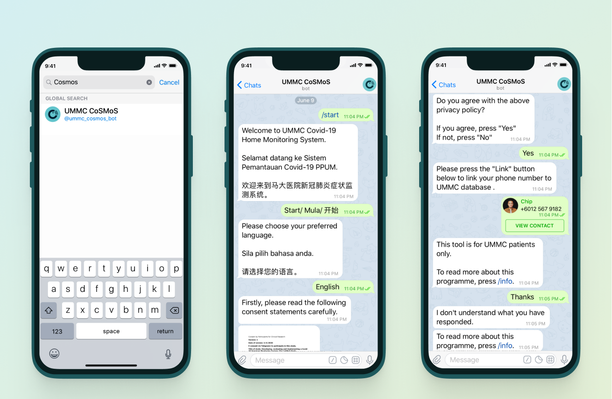

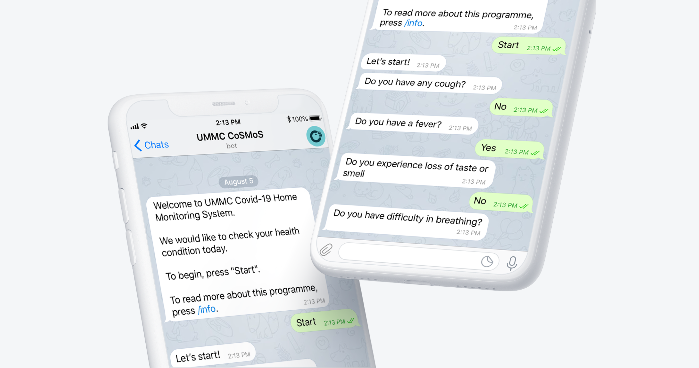

CoSMoS Telegram Chatbot is purposely built for home monitoring purposes. The chatbot helps medical staff to monitor individuals suspected of having contracted COVID-19 and those who are quarantined at home.

In order to accommodate the local language preferences of Malaysian patients, CoSMoS Chabot consists of 3 different languages in Bahasa Malaysia, English, and Mandarin. Compared to the previous situation whereby medical officers have to spend 10-15 minutes on the phone to assess one patient and doing this daily over 14 days, the Chatbot reduces the huge burden of medical professionals who are swamped and are under constant high pressure due to COVID-19.

The chatbot launched successfully on March 28th, 2020.

*Disclaimer: To comply with data privacy and confidentiality of medical records, any health data and patient information presented in this design work is fictitious and has been modified in order to protect patient privacy.*

------

## 02 Separate consumer and enterprise experience

**For Healthcare Professionals**

There are practical needs on why we create a separate dashboard that is oly accessible by the medical research team and healthcare professionals. It should not be the same interface as a chatbot because a dashboard gives an overview of the overall situation and actionable tasks that can help doctors make decisions and take actions quickly. Besides, a chatbot interface also has constraints in terms of viewing, comparing, filtering information and surfacing common patterns, due to the small chunks of information that is only available to be presented at one time.

**Introducing CoSMoS Admin Dashboard**

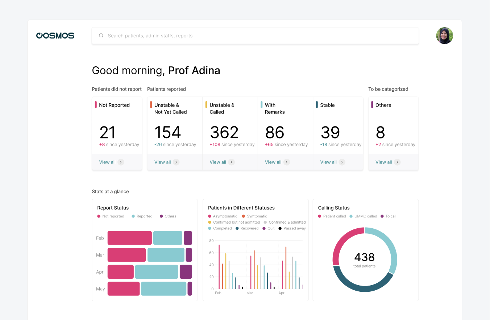

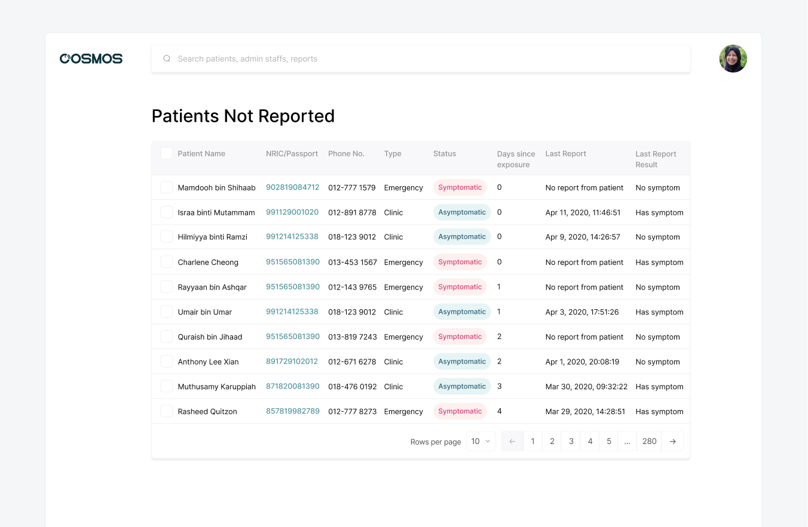

The input of daily symptoms from patients into the Telegram chatbot will be sent to the CoSMoS centralized system to be evaluated, where doctors can access real-time information through the admin dashboard.

With the help of bar charts and data trends visualizations, doctors can easily review patients’ health data in real-time at a glance. Patients whose symptoms have worsened will be contacted and intervened promptly before the health condition deteriorates.

This is a huge improvement compared to the previous workflow because through this system, medical staff would have had to make calls to only 10 percent of patients in need of supervision. The rest of the patients could be monitored through CoSMoS, thus allowing 80-90 percent of medical staff to perform other tasks such as contact tracing and screening. Therefore, healthcare resources could be allocated more efficiently and those in need could be taken care of better.

------

## 03 A unified branding that is digital-first

**Crafting the CoSMoS brand from the ground up**

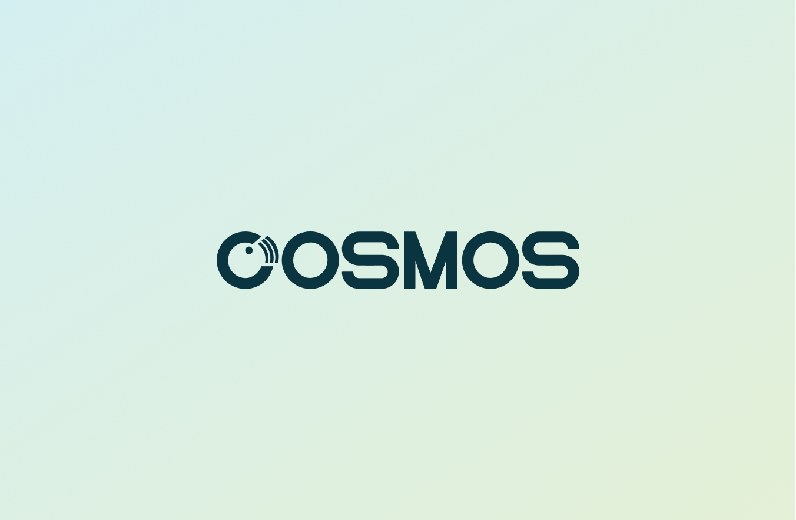

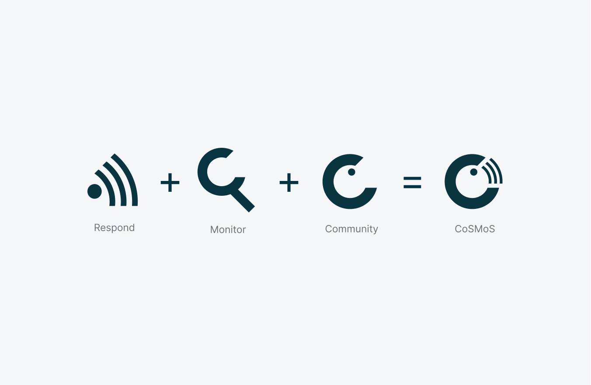At the height of the pandemic, I was required to come up with the logo and branding identity that would become CoSMoS, before the press release went live in a few hours of time. Amidst the intense timeline, I identified the minimum requirement and started working on the brainstorming, logo sketches, lettered mark, various color schemes, applications, which would later form the core foundation of the core brand identity of CoSMoS.

By combining the meaning of “Respond”, “Monitor”, “Community”, my goal is to convey the brand value of CoSMoS as an automated symptom monitoring tool that responds timely, served by a community of healthcare professionals behind the scene for suspected COVID-19 patients. With the help of CoSMoS, healthcare workers are now freed up to help ill patients who need urgent care at the frontline, instead of calling patients. 

**Delivering a consistent, unified branding across platform**

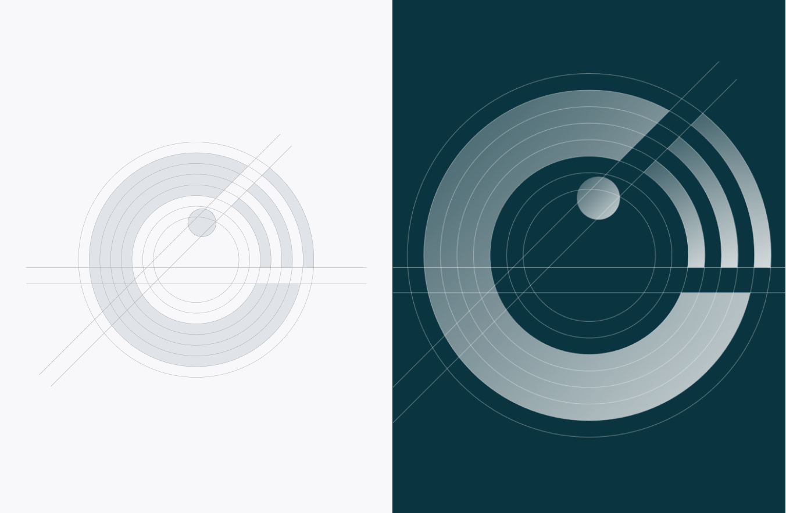

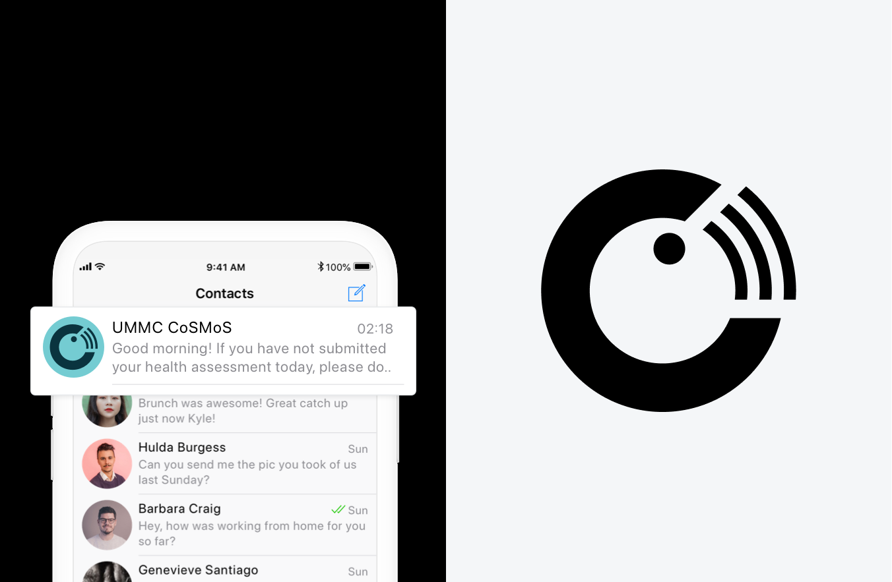

I led the design of CoSMoS end-to-end from branding, Illustration, web design, to team collaboration for implementation. I created the brand identity to provide a consistent experience for our patients and healthcare professionals throughout the 3 major touchpoints–Telegram Chatbot, Medical Dashboard, and Marketing Website. I collaborated with four other engineers to ensure the design are well implemented and worked alongside two medical researchers to gain insights from the clinical perspective and better understand the context as the situation continued to evolve.

**I created custom illustrations for engaging educational tips**

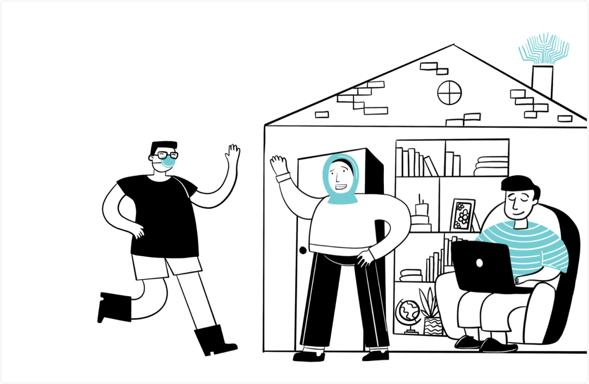

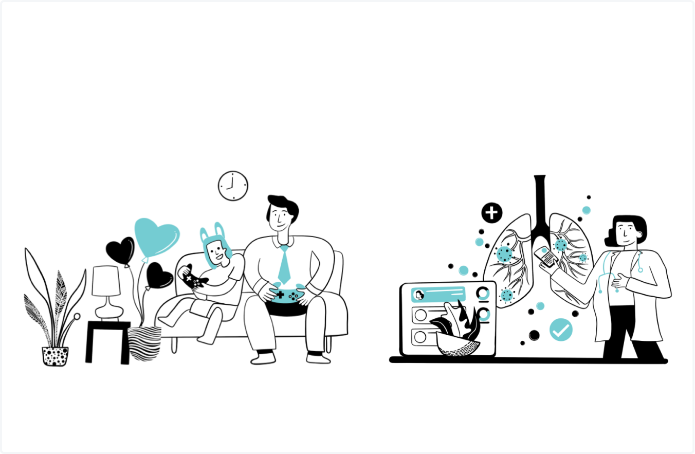

In order to add an element of delight for the educational cards that will be sent out by the CoSMoS Telegram Chatbot, I created custom illustrations that ties in with the brand to engage and educate patients to help them keep updated with the latest trends and precautions.

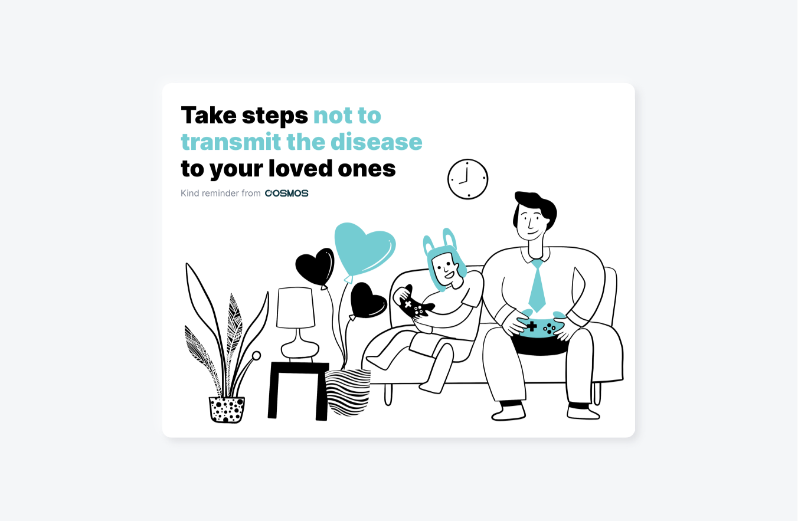

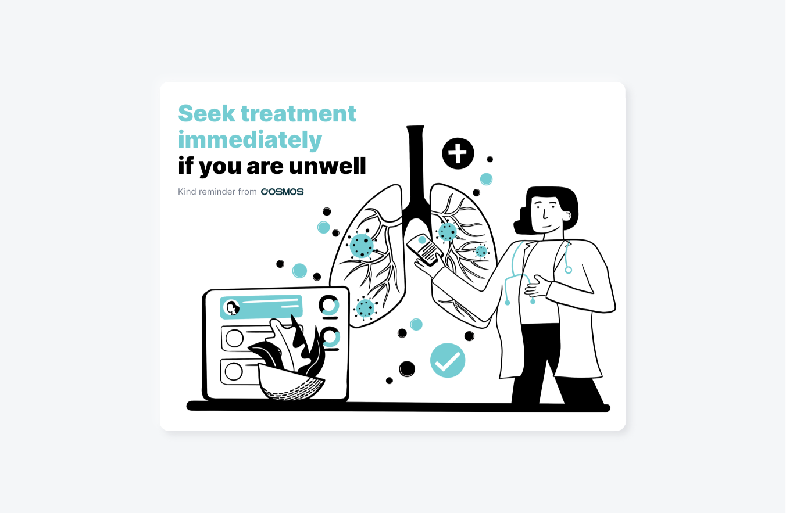

**Introducing CoSMoS Marketing Website**

In order to enhance the accessibility and visibility of the CoSMoS project, a public-facing marketing website is created to serve both researchers and media publications who might be interested to learn more about the project.

Since we use a content management system (CMS) to manage web content, everyone in the CoSMoS team is empowered to create, edit and publish content to ensure the facts are updated from time to time. I ensure that the typography, images, video, and icons are consistent with the brand and visual identity design. We achieved this by creating a fixed template and layout that is editable and flexible enough to be further customized, yet user-friendly equipped with proper image tagging, SEO, mobile responsive and fast loading speed of 3 seconds, and 93% of Google PageSpeed score.

------

## Result

CoSMoS reduces 90% of doctors’ workload in monitoring patients with suspected COVID-19 infection. Developed in just eight days using an agile development model, it was tested rigorously, rapidly and iteratively through a remote collaboration with Malaysian researchers in various countries. CoSMoS has received approval from the University of Malaya Medical Centre (UMMC) Medical Research Ethics Committee and has been successfully tested and implemented at the UMMC Primary Care Clinic and Accident & Emergency Department.

> “CoSMoS would change the management of patients suspected of being infected with Covid-19 who are quarantined at home. Through the system, medical staff at UMMC would no longer have to make phone calls manually to patients. CoSMoS also leverages existing technology to make it accessible to the majority of the community.”

  <b>Datuk Prof Dr Adeeba Kamarulzaman</b> 
  Infectious Diseases Specialist 
  Dean, Faculty of Medicine at University of Malaya

