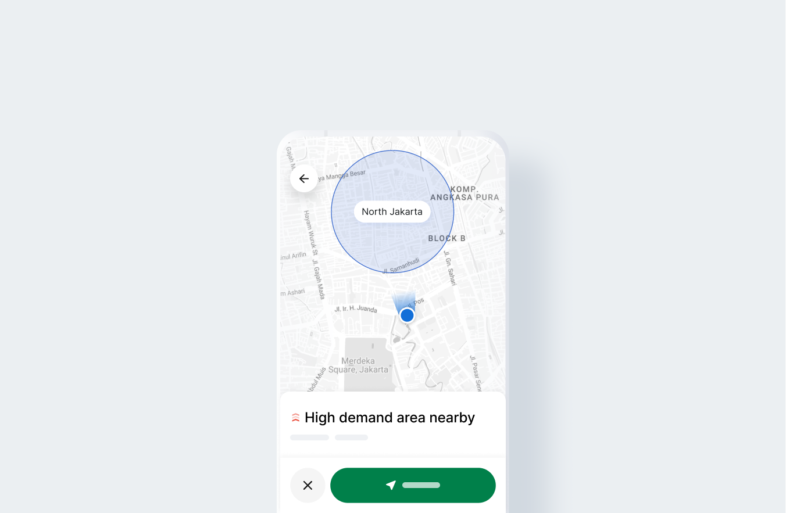
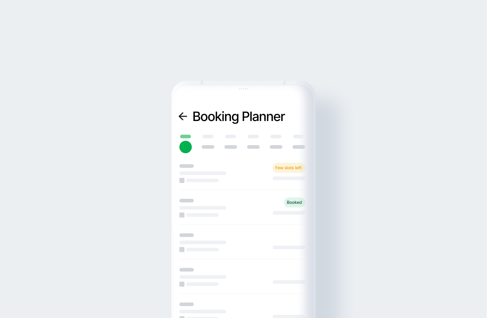
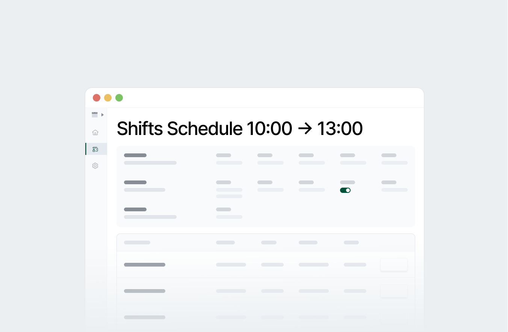

# Helping driver-partners connect to customers in a fast, highly reliable, and cost-efficient platform manner

I'm currently working as a Lead Product Designer, part of the Fulfilment team at Grab, helping driver-partners connect to the customers in a fast, highly reliable, and cost-efficient platform manner.

**Building Tools for Drivers**

My team and I work with data scientists so we can recommend to drivers how to best position themselves in high-demand areas based on past historical and forecast data, to create efficiency and positive experiences for our drivers. I collaborate closely and work cross-functionally with Product, Analytics, Engineering, and Business leaders to continuously enhance various Driver Tools such as Driver Shifts, Treasure Zone, Booking Planner, Heatmap, Earnings, and Incentives.

During 2020 when COVID struck, cities in Vietnam for example faced severe lockdowns and had to rely heavily on food deliveries. My team and I quickly iterated to serve the evolving needs by allowing driver-partners to sign up for Driver Shifts quickly, so they can work in the safe designated zones by the government.

**Increasing Operational Efficiency**

Besides driver tools, I also work on internal tools such as Fare Debugger and Shifts Portal, which aim at empowering Tech Support engineers and the country operations team to directly resolve the root cause by turning complex pricing calculations into simple visualization and removing redundancies of the weekly Shifts set up processes. With the easier way of debugging, troubleshooting, and setting up, not only that customers and driver-partners have been impacted by faster resolution and refund process, but also at the same time, engineers get to spend time on building better products with the time saved from supporting on call tickets.